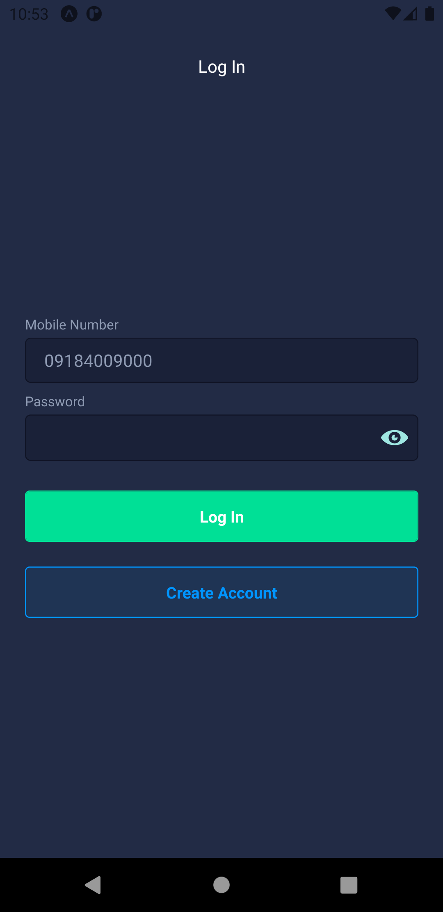
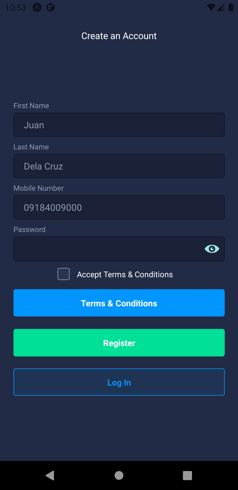
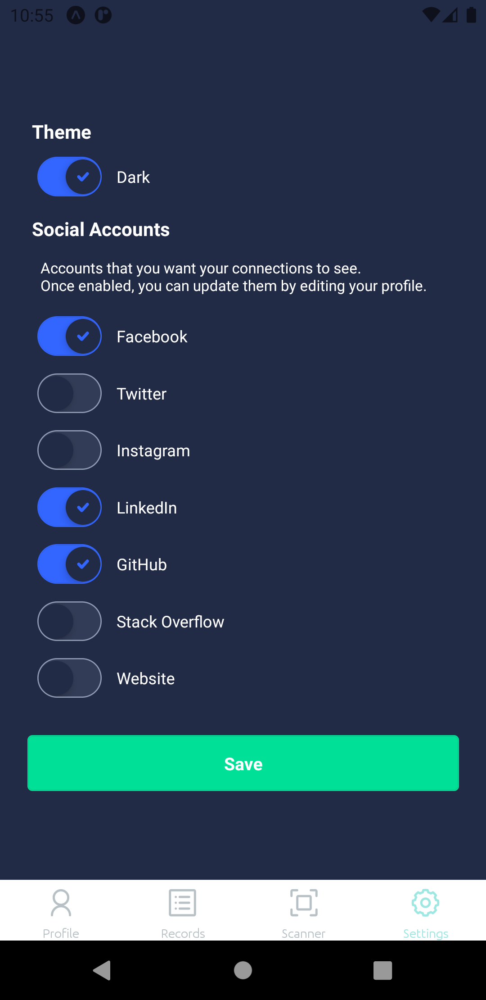
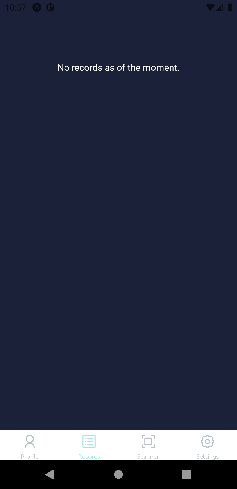
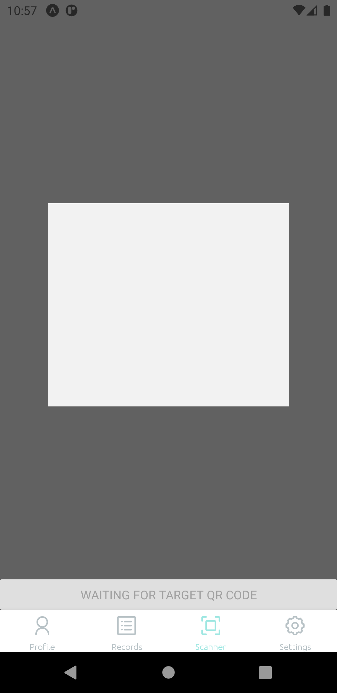
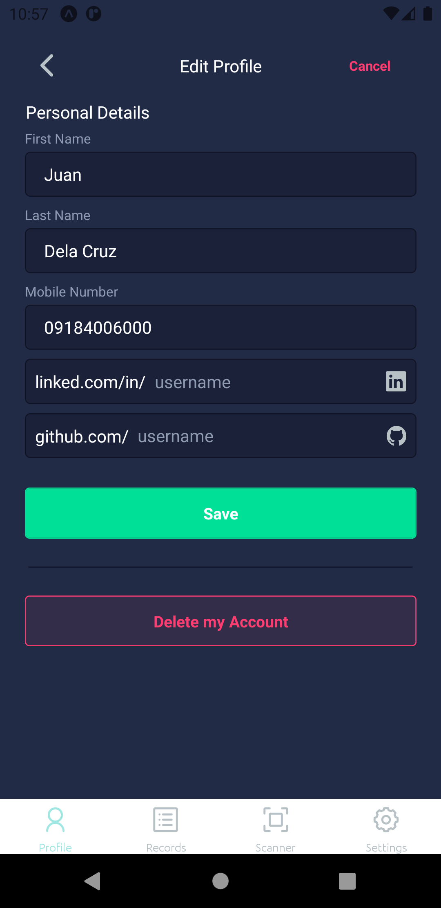

# qrofile

This is a dedicated repository for the release versions of the qrofile project.

### About
The original purpose of this project is to help establishments track and record visitors in a hassle-free manner during the pandemic.   The records could be useful for the potential need of COVID-19 contact tracing.

### Features
1. User
* Register to create a QR code your digital profile
* Include your accounts from various social networks (Facebook, Instagram, Twitter, LinkedIn, etc.)
* Update your details anytime
2. Records
* Easily scan other people QR codes to get their details along with their shared social accounts
3. Settings
* Dark Mode
* Enable/disable a social account from being displayed to those who has your profile
4. Miscellenious 
* Once registered, you can access your records even when you're offline
5. Privacy
* In case of privacy concerns, you may delete your account anytime. Your record will be removed from everyone who scanned your profile

### Sample Screenshots (version 3.x-beta | Android Emulator)

